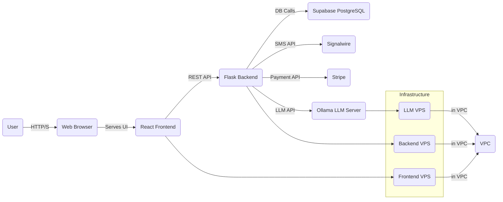
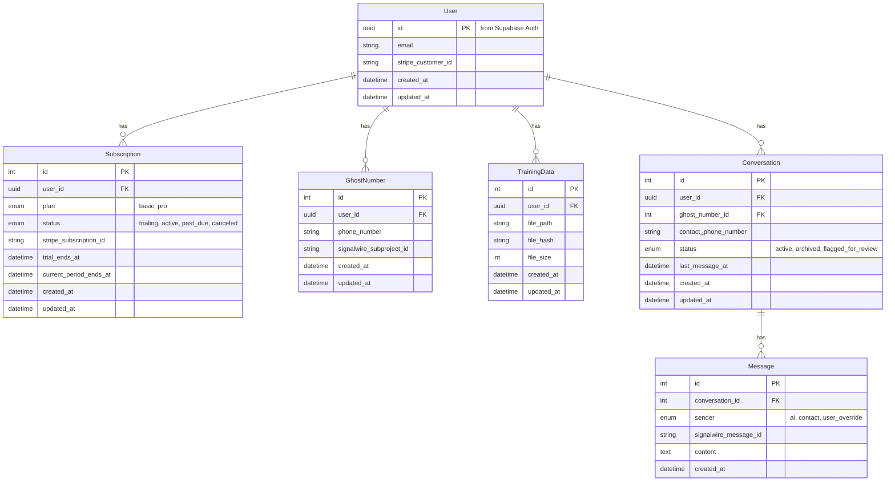

# Assistext Fullstack Architecture

### Introduction

This document outlines the complete fullstack architecture for Assistext, including backend systems, frontend implementation, and their integration. It serves as the single source of truth for AI-driven development, ensuring consistency across the entire technology stack.

This unified approach combines what would traditionally be separate backend and frontend architecture documents, streamlining the development process for modern fullstack applications where these concerns are increasingly intertwined.

#### Starter Template or Existing Project

Based on the PRD, this appears to be a **Greenfield project**, meaning we are building from scratch and not extending an existing codebase or using a specific fullstack starter template.

### High Level Architecture

#### Technical Summary

Assistext will initially adopt a **monolithic architectural style** for its MVP, deployed across dedicated Virtual Private Servers (VPS) within a Virtual Private Cloud (VPC). The frontend will be built with React and TypeScript, communicating with a Python Flask backend via REST APIs. Key integrations include Supabase for the database, Signalwire for SMS, Stripe for payments, and a self-hosted Ollama instance for the LLM. This architecture prioritizes cost-effectiveness, security, and rapid development for the MVP, with future potential for microservices evolution.

#### Platform and Infrastructure Choice

*   **Platform:** Self-managed VPS within a Virtual Private Cloud (VPC).
*   **Key Services:** Compute (VPS instances for Frontend, Backend, and LLM), Networking (VPC for secure internal communication), Ollama (for self-hosted LLM serving).
*   **Deployment Host and Regions:** To be determined.

#### Repository Structure

*   **Structure:** **Polyrepo** (separate repositories for frontend and backend).
*   **Monorepo Tool:** N/A
*   **Package Organization:** Separate repositories for the React/TypeScript frontend and the Python/Flask backend. Shared types or utilities will be managed through conventional package management (e.g., npm/pip install from private registry or direct import if within the same repo).

#### High Level Architecture Diagram

#### Architectural Patterns

*   **Monolith (for MVP):** All core application logic (frontend and backend) is contained within a single deployable unit. - _Rationale:_ Simplifies development, deployment, and testing for the MVP, aligning with the "as cheap as possible" constraint.
*   **Client-Server:** The frontend (client) communicates with the backend (server) via a defined API. - _Rationale:_ Standard web application pattern for separating presentation from business logic.
*   **Component-Based UI:** Frontend built using reusable React components. - _Rationale:_ Promotes modularity, reusability, and maintainability in the UI.
*   **Layered Architecture (Backend):** Backend organized into distinct layers (e.g., presentation/routes, business logic/services, data access). - _Rationale:_ Improves separation of concerns, testability, and maintainability.
*   **API Gateway Pattern (Implicit):** The Flask backend acts as a single entry point for all frontend requests, abstracting external integrations. - _Rationale:_ Centralizes API access, simplifies frontend interaction, and allows for future implementation of cross-cutting concerns like authentication and rate limiting.

### Tech Stack

#### Technology Stack Table

| Category | Technology | Version | Purpose | Rationale |
| :--- | :--- | :--- | :--- | :--- |
| Frontend Language | TypeScript | Latest Stable | Type safety, improved developer experience | PRD specified |
| Frontend Framework | React | Latest Stable | Building user interfaces | PRD specified |
| UI Component Library | Custom Design System | N/A (in-house) | Consistent UI components | Decision from UI/UX Spec |
| State Management | React Context API / Zustand | Latest Stable | Managing frontend application state | Simplicity for MVP, lightweight |
| Backend Language | Python | Latest Stable | Backend application logic | PRD specified |
| Backend Framework | Flask | Latest Stable | Web framework for backend API | PRD specified |
| API Style | REST | 1.0 | Communication between frontend and backend | Standard, widely understood |
| Database | PostgreSQL | Latest Stable | Relational data storage | Supabase default, robust |
| Cache | Redis | Latest Stable | In-memory data store for caching | High performance, versatile |
| File Storage | Supabase Storage | N/A (managed service) | Storing user uploaded files | Integrates with Supabase |
| Authentication | JWT (JSON Web Tokens) | N/A | User authentication and authorization | Standard, stateless, scalable |
| Frontend Testing | Jest / React Testing Library | Latest Stable | Unit and component testing for React | Common, robust |
| Backend Testing | Pytest | Latest Stable | Unit and integration testing for Python | Standard, flexible |
| E2E Testing | Playwright | Latest Stable | End-to-end testing for user flows | Modern, cross-browser |
| Build Tool | Webpack / Vite | Latest Stable | Bundling frontend assets | Standard for React |
| Bundler | (Same as Build Tool) | | | |
| IaC Tool | Terraform | Latest Stable | Infrastructure as Code for VPS | Provider-agnostic, declarative |
| CI/CD | GitHub Actions | N/A | Automated build, test, and deployment | Common, integrated with GitHub |
| Monitoring | Prometheus + Grafana | Latest Stable | Application and infrastructure monitoring | Open-source, customizable |
| Logging | Loki + Grafana | Latest Stable | Application logging for debugging and auditing | Integrates with Grafana |
| CSS Framework | CSS Modules | N/A | Component-scoped styling | PRD specified |

### Data Models (Refined)

#### Data Models Diagram

### API Endpoints (Refined)

#### API Endpoints Table

| Method | Path | Description | Request Body / Response Schema |
| :--- | :--- | :--- | :--- |
| **Authentication** | | (Handled by Supabase client; backend validates JWT) | |
| `GET` | `/api/v1/auth/me` | Get the current authenticated user's details. | Res: `{user}` |
| **Ghost Numbers** | | | |
| `POST` | `/api/v1/ghost-numbers` | Provision a new ghost number for the user. | Res: `{ghost_number}` |
| `GET` | `/api/v1/ghost-numbers` | Get the user's ghost number. | Res: `{ghost_number}` |
| `DELETE`| `/api/v1/ghost-numbers/{id}` | Release a ghost number. | |
| **Training Data** | | | |
| `POST` | `/api/v1/training-data` | Upload a training data file. | Req: `multipart/form-data` with file. Res: `{training_data}` |
| `GET` | `/api/v1/training-data` | Get a list of uploaded training data files. | Res: `[{training_data}]` |
| `DELETE`| `/api/v1/training-data/{id}` | Delete a training data file. | |
| **Conversations** | | | |
| `GET` | `/api/v1/conversations` | Get a list of conversations for the user (paginated). | Res: `[{conversation}]` |
| `GET` | `/api/v1/conversations/{id}` | Get a single conversation with its messages (paginated). | Res: `{conversation_with_messages}` |
| `PUT` | `/api/v1/conversations/{id}` | Update a conversation's status (e.g., archive). | Req: `{status}`. Res: `{conversation}` |
| **Subscriptions** | | | |
| `POST` | `/api/v1/subscriptions/checkout-session` | Create a new Stripe Checkout session. | Req: `{plan}`. Res: `{checkout_session}` |
| `GET` | `/api/v1/subscriptions` | Get the user's subscription details. | Res: `{subscription}` |
| `PUT` | `/api/v1/subscriptions` | Update a subscription (e.g., change plan). | Req: `{plan}`. Res: `{subscription}` |
| `DELETE`| `/api/v1/subscriptions` | Cancel a subscription. | |
| **Webhooks** | | (Must be secured with signature verification) | |
| `POST` | `/webhooks/signalwire` | Receive incoming SMS messages from Signalwire. | Req: Signalwire webhook payload. |
| `POST` | `/webhooks/stripe` | Receive subscription status updates from Stripe. | Req: Stripe webhook payload. |

### Security (Refined)

#### Authentication

*   **Method:** We will use **Supabase Auth**, which is a secure, JWT-based authentication service.
*   **Flow & Token Lifecycle:**
    1.  The React frontend client will use the Supabase library to handle user signup and login.
    2.  Upon successful authentication, Supabase will issue a short-lived **access token** and a long-lived **refresh token**. The Supabase client library will securely manage these tokens.
    3.  The frontend will include the access token in the `Authorization: Bearer <token>` header of every request to our backend API. The client will automatically use the refresh token to get a new access token when the old one expires.
    4.  The Flask backend will validate the JWT signature on every incoming request to ensure its authenticity and integrity.
*   **Password Policy & MFA:** Password policies (e.g., complexity) will be configured in and enforced by Supabase. Multi-Factor Authentication (MFA) is not planned for the MVP but can be easily enabled in the future through Supabase.

#### Authorization

*   **Strategy:** Our authorization model is based on data ownership. An authenticated user can only access and manipulate data that they own.
*   **Implementation:** The backend will enforce this on every API request by ensuring the `user_id` from the validated JWT matches the `user_id` associated with the requested resource (e.g., a conversation, a ghost number).

#### Data Encryption

*   **In Transit:** All communication will be encrypted using **TLS/SSL (HTTPS)**. This applies to user-to-frontend, frontend-to-backend, and backend-to-external-service communication.
*   **At Rest (Infrastructure-Level):** We will leverage the default encryption provided by our managed services. **Supabase** encrypts database content and files in Supabase Storage at rest.
*   **At Rest (Application-Level):** For highly sensitive data, specifically the content of SMS messages, we will implement an additional layer of security. The backend application will **encrypt message content before it is stored** in the database. This ensures that the message content is never stored in plain text, providing a critical layer of defense.

#### PII Handling and Data Minimization

*   **Strategy:** We will adopt a strict policy for handling Personally Identifiable Information (PII).
*   **Implementation:**
    *   **Logging:** We will avoid logging sensitive PII (e.g., message content, phone numbers) wherever possible. Where necessary for debugging, we will implement data masking.
    *   **Data Retention:** We will establish clear data retention policies to automatically purge old conversations and messages after a defined period, minimizing the amount of sensitive data we store over time.

#### Input Validation

*   **Strategy:** We will implement strict input validation on both the frontend and backend. We will never trust data coming from the client.
*   **Frontend:** Use a library like **Zod** for form validation to provide immediate feedback to the user.
*   **Backend:** Use a library like **Pydantic** to validate the structure, type, and content of all incoming API request data before it is processed.

#### Dependency Management

*   **Strategy:** We will use automated tools to scan our application dependencies for known vulnerabilities.
*   **Implementation:** Use **Dependabot** (integrated with GitHub) to automatically create pull requests to update vulnerable dependencies.

#### Secrets Management

*   **Strategy:** All secrets (API keys, database URLs, JWT signing keys) will be managed securely and will **never be committed to source control**.
*   **Implementation:** Use **environment variables** for local development. In production, use the secure secret management solution provided by our hosting platform or a dedicated service like HashiCorp Vault.

#### Rate Limiting

*   **Strategy:** We will implement rate limiting at both the application and infrastructure levels.
*   **Application-Level:** Use a library like **`flask-limiter`** on the backend to prevent abuse of specific endpoints.
*   **Infrastructure-Level:** Implement rate limiting at our reverse proxy (e.g., Nginx) or cloud load balancer as a first line of defense against DoS attacks.

#### CORS (Cross-Origin Resource Sharing)

*   **Policy:** The Flask backend will be configured with a strict CORS policy to only allow requests from the specific domain of our deployed frontend application.

#### CSP (Content Security Policy)

*   **Policy:** The frontend will serve a strict Content Security Policy (CSP) header to prevent Cross-Site Scripting (XSS) attacks by specifying which sources of content (scripts, styles, images) are allowed to be loaded by the browser.

#### Security Headers

*   **Strategy:** We will configure our web server to include standard security headers like `Strict-Transport-Security` (HSTS), `X-Content-Type-Options`, `X-Frame-Options`, and `Referrer-Policy` to protect against common web vulnerabilities.

### Deployment (Refined)

#### CI/CD Pipeline

*   **Provider:** We will use **GitHub Actions** for our Continuous Integration and Continuous Deployment (CI/CD) pipelines. We will have separate pipelines for the frontend and backend repositories.
*   **Frontend Pipeline:**
    *   **Trigger:** On push to `main` branch or pull request to `main`.
    *   **Jobs:**
        1.  **Lint & Test:** Run static analysis and unit/component tests.
        2.  **Build:** Create a production-ready static build of the React application.
        3.  **Deploy:** Securely copy the build artifacts to the Frontend VPS and make them available via Nginx.
*   **Backend Pipeline (Zero-Downtime):**
    *   **Trigger:** On push to `main` branch or pull request to `main`.
    *   **Jobs:**
        1.  **Lint & Test:** Run static analysis and unit/integration tests.
        2.  **Build Docker Image:** Build a Docker image containing the Flask application and its dependencies.
        3.  **Push to Registry:** Push the tagged Docker image to **GitHub Container Registry**.
        4.  **Deploy:**
            a. Start the new version of the application container on a different port on the Backend VPS.
            b. Run a health check on the new container.
            c. If the health check passes, update the Nginx reverse proxy to point to the new container's port.
            d. Stop the old container.

#### Infrastructure Setup

*   **Hosting:** The application will be hosted on **three Virtual Private Servers (VPS)** within a single Virtual Private Cloud (VPC) for secure communication.
    *   **Frontend VPS:** Runs Nginx to serve the static React build.
    *   **Backend VPS:** Runs the Flask application (using Gunicorn) behind an Nginx reverse proxy, and also runs **Redis in a Docker container** for the MVP to reduce cost.
    *   **LLM VPS:** Runs the self-hosted Ollama server.
*   **Provisioning:** The entire infrastructure will be provisioned and managed using **Terraform**.
*   **Managed Services:**
    *   **Database & File Storage:** Supabase will provide our PostgreSQL database and file storage.

#### Environment Strategy

*   **Development:** A local development environment will be managed using **Docker Compose** to closely mimic the production setup (e.g., running backend, Redis, etc., in containers).
*   **Production:** The live environment hosted on our provisioned VPSs.
*   **Staging:** A dedicated staging environment is not planned for the MVP to minimize costs, but can be easily added in the future by replicating the Terraform configuration.

#### Health Checks

*   **Strategy:** We will implement health check endpoints on our services to allow for automated monitoring.
*   **Backend:** A `GET /api/v1/health` endpoint that returns a `200 OK` status if the service is healthy (e.g., can connect to the database and Redis).
*   **LLM Server:** A similar `GET /health` endpoint on the Ollama server.
*   **Usage:** These endpoints will be used by our Prometheus monitoring system to track service uptime and by the deployment system to verify a successful deployment before shifting traffic.

#### Rollback Strategy

*   **Automated Rollback:** CI/CD pipelines will be configured to automatically halt and roll back if any step (e.g., tests, build, deployment script) fails.
*   **Manual Rollback:** For issues discovered after a successful deployment:
    *   **Frontend:** Re-deploy the previous stable build artifact from storage.
    *   **Backend:** Re-deploy the previous stable Docker image tag from GitHub Container Registry.
    *   **Database:** Database migrations will be handled carefully with a tool like Alembic, which supports both `upgrade` and `downgrade` scripts. **Note:** `downgrade` scripts can be risky and should be written and tested with extreme care. For any critical production data issues, our primary recovery strategy will be **restoring from the point-in-time backups** provided by Supabase.

### Cost Analysis

#### Monthly Cost Breakdown (Estimated)

This table breaks down the estimated fixed monthly costs for running the Assistext MVP. Variable, usage-based costs (like Stripe fees) are not included as they depend on revenue.

| Service | Item | Estimated Monthly Cost | Notes |
| :--- | :--- | :--- | :--- |
| **Infrastructure** | Frontend VPS (2 vCPU, 4GB RAM) | ~$20 | Standard server for hosting a static site. |
| | Backend + Redis VPS (4 vCPU, 8GB RAM) | ~$40 | A more powerful server to handle application logic and caching. |
| | LLM VPS (with low-end GPU) | ~$150 | The most significant cost, required for running the Ollama LLM. |
| **Database & Storage** | Supabase Pro Plan | $25 | For daily backups, support, and production readiness. |
| **Telephony** | Signalwire | ~$10 | Usage-based. Includes phone number rental and a small volume of SMS messages for the MVP. |
| **CI/CD & Source Control**| GitHub | $0 | The free tier for private repositories is sufficient for our MVP needs. |
| **Total** | | **~$245 / month** | |

#### Cost Optimization Strategies

Our architecture is designed to be cost-effective for the MVP, but we can employ several strategies to manage and optimize costs as we grow:

*   **Right-Sizing Infrastructure:** We will start with the estimated VPS sizes and continuously monitor their performance using Prometheus/Grafana. We can easily scale them up or down as needed to match our actual resource usage.
*   **Reserved Instances:** Once we have a predictable usage pattern, we can commit to 1- or 3-year reserved instances for our VPSs, which can offer significant discounts (up to 40-60%) compared to on-demand pricing.
*   **LLM Server Optimization:** The LLM server is our largest cost. We can explore:
    *   Using smaller, more efficient LLM models that require less powerful (and cheaper) GPU resources.
    *   Implementing a "sleep" mode where the GPU instance is only active when needed (this adds significant complexity and is a future consideration).
*   **Efficient Service Usage:** We will monitor our usage of Supabase and Signalwire to ensure we are operating efficiently and not incurring unnecessary costs.
*   **Autoscaling (Future):** While not planned for the MVP, we can eventually move to an architecture that supports autoscaling, allowing us to automatically adjust the number of servers based on traffic load.

### Architecture Decision Log

#### Architecture Decision Log Table

| Decision | Context | Rationale | Trade-offs |
| :--- | :--- | :--- | :--- |
| **1. Architecture Style: Monolith for MVP** | Greenfield project requiring rapid development and low initial complexity. | Simplifies development, deployment, and testing for the MVP, reducing time to market. | Less scalable than microservices in the long run; tighter coupling between components. |
| **2. Repository Structure: Polyrepo** | Separate frontend (React) and backend (Python) codebases with distinct concerns. | Enforces a clear separation of concerns and allows for independent deployment pipelines and development cadences. | Can be more complex to manage shared code or types compared to a monorepo. |
| **3. Hosting: Self-Managed VPS in VPC** | Need for a cost-effective, secure, and flexible hosting solution that can accommodate a self-hosted LLM. | Provides full control over the environment, is cost-effective for predictable workloads, and allows for custom software installation (Ollama). | More operational overhead (setup, maintenance, security) compared to a fully managed PaaS (e.g., Heroku, Vercel). |
| **4. Authentication: Supabase Auth** | Need for a secure and reliable authentication system without the complexity of building one from scratch. | Offloads significant security complexities (password hashing, JWT management, etc.) to a trusted third party, accelerating development. | Creates a dependency on a third-party service; less control over the specific authentication mechanisms. |
| **5. LLM: Self-Hosted Ollama** | Need for a powerful and customizable LLM that can be fine-tuned on user data while managing costs. | Provides full control over the model, avoids per-request costs of third-party APIs, and allows for private fine-tuning. | Significant infrastructure cost (GPU server) and operational overhead (model management, server maintenance). |
| **6. Deployment: Zero-Downtime via CI/CD** | Need for a reliable and automated deployment process that does not interrupt the user experience. | Improves user experience by ensuring the application is always available, even during updates. Increases developer confidence. | Slightly more complex pipeline configuration compared to a simple "stop and restart" deployment. |
