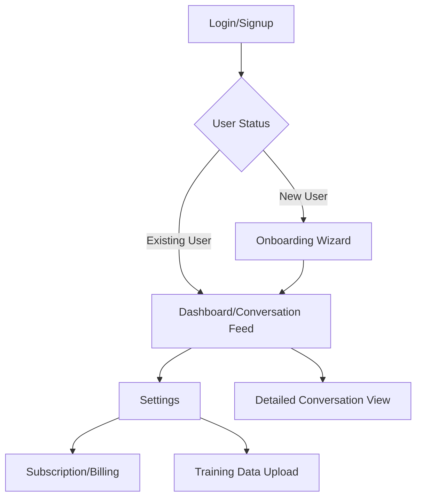
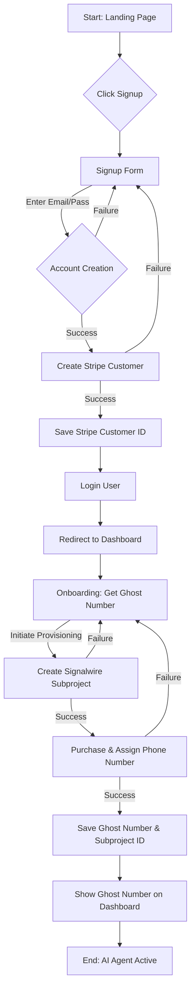
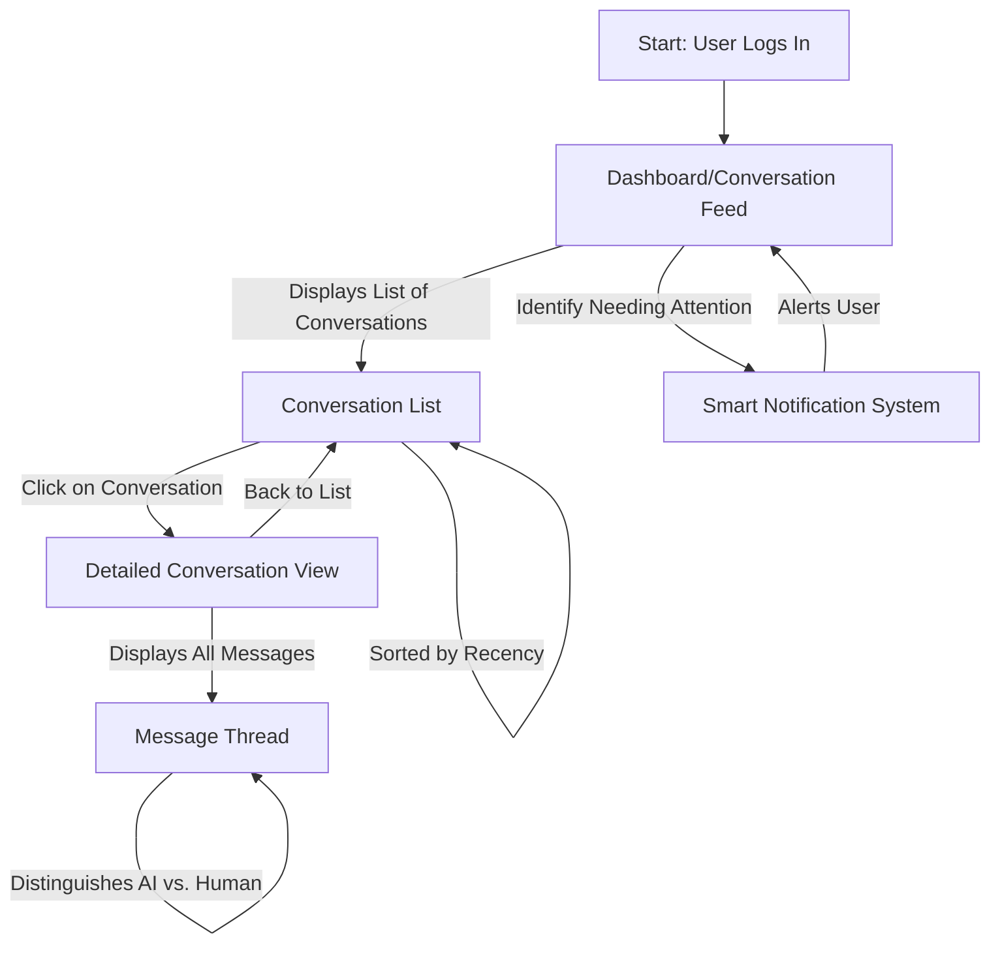
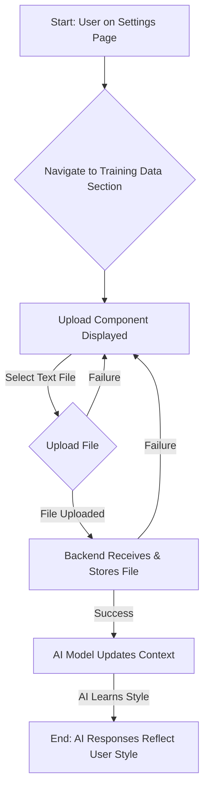
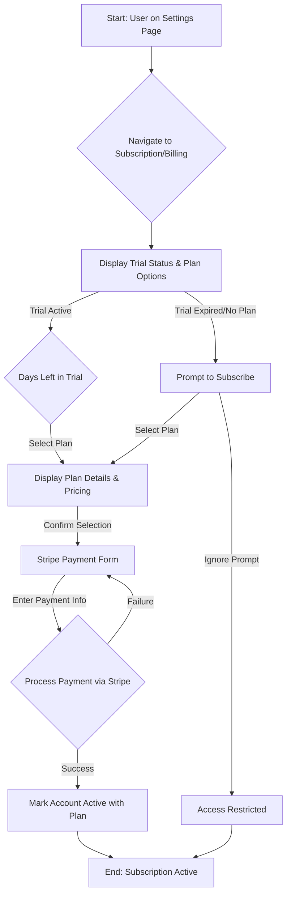

# Assistext UI/UX Specification

## Introduction

This document defines the user experience goals, information architecture, user flows, and visual design specifications for Assistext's user interface. It serves as the foundation for visual design and frontend development, ensuring a cohesive and user-centered experience.

### Overall UX Goals & Principles

#### Target User Personas

*   **Primary User Segment: Escorts:** Predominantly women. Their current workflow is hectic, disorganized, and unreliable. They need to bring order to their inbox, reduce anxiety, prioritize legitimate clients, and maintain privacy/safety. Their goals are to book serious, non-threatening clients, filter out time-wasters, and maintain privacy.
*   **Secondary User Segment: Busy Businesses:** Small to medium-sized businesses with high-volume inbound text messages (e.g., e-commerce, local service providers, 24/7 support). Their workflow is also disorganized and overwhelming. They need to manage message volume, provide 24/7 support without extra staff, and answer FAQs instantly. Their goals are to improve customer satisfaction, reduce support costs, and ensure every potential lead or customer query is captured and addressed promptly.

#### Usability Goals

*   **Ease of Learning:** New users should be able to complete the onboarding process and have their AI agent active in under 5 minutes.
*   **Efficiency of Use:** Users should be able to monitor conversations and manage basic settings with minimal clicks and effort.
*   **Error Prevention:** The UI should guide users to prevent common mistakes, especially during setup and critical actions.
*   **Feedback & Transparency:** The UI should provide clear and immediate feedback on the AI's actions and conversation status.
*   **Discreet Monitoring:** Users should be able to quickly glance at their dashboard to understand the AI's activity without constant distraction.

#### Design Principles

1.  **Simplicity & Focus:** Prioritize essential functionality and a clean interface, avoiding clutter to reduce cognitive load.
2.  **Discreet Empowerment:** Provide powerful AI capabilities in a non-intrusive manner, giving users control without overwhelming them.
3.  **Consistent & Intuitive:** Use familiar UI patterns and maintain consistency across the application for ease of learning and use.
4.  **Transparent Feedback:** Clearly communicate the AI's actions, status, and any necessary user interventions.
5.  **Privacy by Design:** Ensure all design choices reinforce user privacy and data security.
6.  **Mobile-First Aesthetic:** Design for optimal experience on mobile devices, leveraging the vibrant color palette and Space Grotesk font.

### Change Log

| Date | Version | Description | Author |
| :--- | :--- | :--- | :--- |

## Information Architecture (IA)

#### Site Map / Screen Inventory

#### Navigation Structure

**Primary Navigation:**
*   **Dashboard/Conversation Feed:** This will be the main hub after login, providing an overview of AI activity.
*   **Settings:** A dedicated section for managing account details, subscriptions, and AI training data.

**Secondary Navigation:**
*   **Within Settings:** Sub-navigation will allow users to switch between sections like "Subscription/Billing," "Training Data Upload," and "Account Profile."
*   **Within Dashboard:** Individual conversation threads will be accessible from the main feed, acting as a secondary level of navigation.

**Breadcrumb Strategy:**
*   Simple breadcrumbs will be used for deeper navigation paths (e.g., `Dashboard > Settings > Subscription`) to help users understand their location within the application. They will not be necessary for top-level views.

## User Flows

#### User Onboarding Flow

**User Goal:** As a new user, I want to sign up for Assistext, get my ghost phone number, and have my AI agent ready to respond to messages.

**Entry Points:** Assistext Landing Page / Signup Button.

**Success Criteria:** User account created, Stripe customer created, Signalwire subproject and ghost number provisioned, user redirected to dashboard, AI agent active.

##### Flow Diagram

##### Edge Cases & Error Handling:

*   **Existing Email during Signup:** The system should inform the user that the email is already registered and prompt them to log in or use a different email.
*   **Stripe Customer Creation Failure:** The system should display a user-friendly error message, log the error, and allow the user to retry or contact support. Account creation should be rolled back or marked as incomplete.
*   **Signalwire Subproject Creation Failure:** The system should display an error, log the issue, and allow the user to retry provisioning or contact support.
*   **Signalwire Phone Number Purchase Failure:** The system should inform the user if no numbers are available or if the purchase fails, and offer to retry or notify them when numbers become available.
*   **Database Write Failure:** Critical errors should trigger system alerts, log details, and present a generic error message to the user, prompting them to retry or contact support.
*   **User Abandons Onboarding:** The system should save the user's progress (if any) and allow them to resume later, or provide clear instructions on how to restart.
*   **Duplicate Ghost Number Assignment:** (Highly unlikely with Signalwire, but good to consider) System attempts to assign a number already in use.

##### Notes

**Notes:**
*   Consider implementing a progress indicator during the ghost number provisioning step, as this involves external API calls and might take a few seconds. This will improve user experience by providing feedback during potential delays.
*   Ensure clear and prominent messaging for users regarding the 14-day free trial during the signup and onboarding process. This manages expectations and encourages conversion.
*   Future consideration: What happens if a user's chosen email is already associated with a Stripe customer (e.g., from a previous, incomplete signup) but not an active Assistext account? This might require a specific recovery or merge flow.

#### User Flow: AI Conversation Monitoring

**User Goal:** As a user, I want to easily monitor the conversations my AI agent is having, ensuring quality and identifying any conversations that require my direct attention.

**Entry Points:** Dashboard/Conversation Feed (after login).

**Success Criteria:** User can view a list of conversations, distinguish between AI and human messages, and quickly identify conversations needing intervention.

##### Flow Diagram

##### Edge Cases & Error Handling:

*   **No Conversations Yet:** The dashboard should display a clear message indicating no conversations and guide the user on how to initiate one (e.g., "Share your ghost number to start receiving messages!").
*   **Large Volume of Conversations:** Implement pagination, infinite scroll, or filtering options to ensure the dashboard remains performant and usable even with thousands of conversations.
*   **Message Loading Failure:** Display a clear error message within the conversation view (e.g., "Failed to load messages. Please try again.") and provide a retry mechanism.
*   **AI Response Delay:** Provide visual feedback (e.g., "AI is typing...") and a clear indication if a response is taking longer than expected. Consider a timeout and a fallback message.
*   **Smart Notification System Malfunction:** Implement logging and monitoring for the notification system to detect failures. Provide a manual override or a "flag for review" option for users.
*   **Deleted Conversation:** If a user attempts to view a conversation that no longer exists, display a "Conversation not found" message.
*   **Unusual Message Content:** The AI should have a fallback mechanism for content it cannot process (e.g., "I'm not sure how to respond to that. Please check your dashboard.") and flag such instances for user review.

##### Notes

**Notes:**
*   Consider implementing a "mark as read" or "archive" feature for conversations to help users manage their inbox and focus on new or unreviewed interactions.
*   Explore options for filtering and searching conversations (e.g., by contact, keywords, date) to enhance usability for users with a high volume of messages.
*   The "smart notification system" will require careful design and tuning to avoid false positives and ensure it truly highlights critical conversations that require user intervention. This will be key to maintaining the "set it and forget it" promise.
*   Future consideration: How will manual takeover of conversations be integrated into this view? This will be a critical feature post-MVP and should be considered in the underlying architecture.

#### User Flow: Uploading Training Data

**User Goal:** As a user, I want to easily upload my past text message examples so that the AI can learn and mimic my unique communication style.

**Entry Points:** Settings Page > Training Data section.

**Success Criteria:** User can successfully upload a text file, the system processes it, and the AI's responses qualitatively reflect the user's style.

##### Flow Diagram

##### Edge Cases & Error Handling:

*   **Invalid File Type:** The system should validate the file type on upload and display an error message if it's not a plain text file (e.g., "Please upload a .txt file.").
*   **File Size Exceeds Limit:** The system should display an error message if the file size exceeds the predefined limit (e.g., "File too large. Maximum size is X MB.").
*   **Empty File Upload:** The system should inform the user if an empty file is uploaded and explain that it cannot be used for training.
*   **Corrupted File Upload:** The system should detect corrupted files during upload or processing, display an error, and prompt the user to retry.
*   **Backend Processing Failure:** If an error occurs during backend processing or storage, the system should log the error, display a user-friendly message, and suggest retrying or contacting support.
*   **AI Model Update Failure:** The system should notify the user if the AI model fails to update its context, and provide guidance on troubleshooting or contacting support.
*   **User Uploads Sensitive Data:** While the system cannot prevent this, the UI should include a clear warning about not uploading sensitive personal information and that the data will be used for AI training.

##### Notes

**Notes:**
*   Consider providing clear visual feedback during the upload process (e.g., progress bar, success/failure message) to enhance user experience, especially for larger files.
*   Clarify the expected format and content of the text file (e.g., plain text, conversational style, minimum word count) to optimize AI learning and prevent issues.
*   Future consideration: Implement a mechanism for users to view or manage their uploaded training data, and potentially delete or replace old datasets. This would give users more control over their AI's learning.
*   Future consideration: Explore options for incremental training or fine-tuning the AI model with new data, rather than requiring a full re-training with each upload. This could improve efficiency and AI adaptation.

#### User Flow: Subscription Management

**User Goal:** As a user, I want to easily manage my subscription, including selecting a plan, providing payment information, and understanding my trial status, so that I can continue using Assistext without interruption.

**Entry Points:** Settings Page > Subscription/Billing section; Trial expiration notifications.

**Success Criteria:** User can successfully select a plan, make a payment, and their subscription status is accurately reflected in the system.

##### Flow Diagram

##### Edge Cases & Error Handling:

*   **Stripe Payment Failure:** The system should display a clear, user-friendly error message (e.g., "Payment failed. Please check your card details or try another method."), log the error, and guide the user to retry or contact support.
*   **Trial Expiration without Subscription:** The system should restrict access to core features, clearly communicate the trial expiration, and provide prominent calls to action for subscription.
*   **Subscription Cancellation:** The system should confirm the cancellation, inform the user of the effective date (end of current billing period), and clearly state any loss of features.
*   **Plan Downgrade/Upgrade:** The system should clearly communicate the changes in features and billing, and confirm the new plan status. Proration should be handled correctly by Stripe.
*   **Network Issues during Payment:** The system should provide feedback that there was a connection issue, advise the user to check their internet, and offer a retry option.
*   **Invalid Promo Code (if applicable):** The system should immediately validate and inform the user if a promo code is invalid or expired.
*   **Multiple Payment Attempts:** The system should prevent duplicate charges and provide clear feedback if a payment is already pending or processed.

##### Notes

**Notes:**
*   Consider implementing dunning management (automated retries for failed payments) through Stripe to minimize involuntary churn.
*   Ensure clear and prominent communication of message limits and any potential overage charges for both Basic and Pro tiers to manage user expectations.
*   Future consideration: Allow users to view their billing history and download invoices directly from the application for better financial transparency.
*   Future consideration: Implement a grace period after trial expiration or payment failure before full service restriction, providing a final opportunity for users to reactivate their subscription.

## Wireframes & Mockups

**Primary Design Files:** Figma (Detailed wireframes and mockups will be created and maintained in Figma, with links provided to specific frames or flows as needed.)

## Component Library / Design System

**Design System Approach:** Create a new, custom design system

#### Core Components

##### Buttons

*   **Purpose:** Enable user actions and navigation within the application.
*   **Variants:**
    *   **Primary:** For the most important action on a screen (e.g., "Sign Up," "Save Changes").
    *   **Secondary:** For alternative or less prominent actions (e.g., "Cancel," "Learn More").
    *   **Tertiary:** For actions that are part of a group but less emphasized.
    *   **Link:** Text-based buttons for navigation or inline actions.
*   **States:** Default, Hover, Focus, Active, Disabled, Loading.
*   **Usage Guidelines:**
    *   Use primary buttons sparingly to maintain their impact.
    *   Maintain consistent sizing and spacing across all button types.
    *   Ensure sufficient contrast for all states, especially for accessibility.

##### Input Fields

*   **Purpose:** Allow users to enter text, numbers, or select options within forms and search functionalities.
*   **Variants:**
    *   **Text:** For general single-line text input (e.g., names, addresses).
    *   **Password:** For sensitive input, masking characters.
    *   **Email:** For email addresses, often with specific validation.
    *   **Number:** For numerical input, potentially with step controls.
    *   **Textarea:** For multi-line text input (e.g., messages, descriptions).
    *   **Search:** For search queries, often with an associated icon.
*   **States:** Default, Hover, Focus, Active, Disabled, Error (e.g., invalid input), Success (e.g., valid input).
*   **Usage Guidelines:**
    *   Always include clear, persistent labels above or beside the input field.
    *   Use placeholder text sparingly, primarily as a hint rather than a label.
    *   Provide real-time validation feedback for errors (e.g., red border, error message).
    *   Ensure sufficient padding and clear visual boundaries for readability and clickability.

##### Forms

*   **Purpose:** Organize and present input fields for data collection, such as user signup, login, settings updates, and training data uploads.
*   **Variants:**
    *   **Single-column:** For simplicity and mobile-first design.
    *   **Multi-column:** For wider screens where space allows for better organization of related fields.
    *   **Step-by-step:** For complex processes like the onboarding wizard, breaking down tasks into manageable steps.
*   **States:** Default, Validated (all fields correctly filled), Submitting (during asynchronous submission), Submitted (success), Submitted (error).
*   **Usage Guidelines:**
    *   Group related fields logically with clear headings or visual separation.
    *   Provide clear and concise calls to action (e.g., "Submit," "Save," "Next").
    *   Offer clear and immediate feedback on submission status (success messages, error messages, loading indicators).
    *   Ensure accessibility for keyboard navigation, screen readers, and clear focus management.

##### Typography

*   **Purpose:** Establish a clear visual hierarchy, ensure readability, and maintain brand consistency for all text content.
*   **Font Families:**
    *   **Primary:** Space Grotesk
    *   **Secondary/Fallback:** system-ui, -apple-system, BlinkMacSystemFont, "Segoe UI", Roboto, Oxygen, Ubuntu, Cantarell, "Open Sans", "Helvetica Neue", sans-serif
    *   **Monospace:** "SFMono-Regular", Consolas, "Liberation Mono", Menlo, Courier, monospace
*   **Type Scale:**
    | Element | Size | Weight | Line Height |
    | :--- | :--- | :--- | :--- |
    | H1 | 3rem | 700 (Bold) | 1.2 |
    | H2 | 2.25rem | 700 (Bold) | 1.3 |
    | H3 | 1.75rem | 600 (Semi-Bold) | 1.4 |
    | Body | 1rem | 400 (Regular) | 1.5 |
    | Small | 0.875rem | 400 (Regular) | 1.4 |
*   **Usage Guidelines:**
    *   Maintain consistent application of font families, sizes, and weights across all screens.
    *   Ensure optimal line height and letter spacing for readability on various screen sizes.
    *   Prioritize sufficient color contrast for all text against its background, adhering to accessibility standards.

##### Icons

*   **Purpose:** Visually represent actions, features, or categories, enhancing usability, reducing cognitive load, and adding visual appeal.
*   **Variants:**
    *   **Outline:** For default or inactive states.
    *   **Filled:** For active or selected states, or to denote emphasis.
    *   **Sizes:** Standardized sizes (e.g., 16px, 24px, 32px) for different contexts (inline, buttons, navigation).
*   **States:** Default, Hover, Focus, Active, Disabled.
*   **Usage Guidelines:**
    *   Use icons consistently to represent the same meaning throughout the application. Avoid using the same icon for different actions.
    *   Always pair icons with clear text labels unless their meaning is universally understood (e.g., a "play" button).
    *   Ensure icons are clear, legible, and maintain visual consistency with the overall design system.
    *   Prioritize accessibility by providing alternative text (alt text) for screen readers.

##### Modals/Dialogs

*   **Purpose:** Display critical information, gather user input, or confirm actions without navigating away from the current page, maintaining context.
*   **Variants:**
    *   **Alert:** For critical, non-actionable messages (e.g., "Error occurred").
    *   **Confirmation:** For user decisions requiring explicit confirmation (e.g., "Are you sure you want to delete?").
    *   **Form:** To collect user input within a temporary overlay (e.g., "Edit Profile").
*   **States:** Open, Closed.
*   **Usage Guidelines:**
    *   Use sparingly for essential interactions to avoid disrupting user flow and causing frustration.
    *   Ensure clear primary and secondary actions (e.g., "Confirm" and "Cancel") are present when user input or decision is required.
    *   Provide a clear and intuitive way to close the modal (e.g., close button, escape key, outside click).
    *   Ensure proper focus management for accessibility (focus moves into modal when opened, and returns to trigger element when closed).

##### Notifications/Toasts

*   **Purpose:** Provide brief, non-intrusive, and timely feedback to the user about system status, success of an action, or errors, without interrupting their workflow.
*   **Variants:**
    *   **Success:** For positive feedback (e.g., "Settings saved successfully!").
    *   **Error:** For critical issues or failed actions (e.g., "Upload failed. Invalid file type.").
    *   **Warning:** For important but non-critical information (e.g., "Trial expiring soon.").
    *   **Info:** For general, informative messages (e.g., "Processing your request...").
*   **States:** Visible, Hidden (auto-dismissing or manually dismissible).
*   **Usage Guidelines:**
    *   Keep messages concise, clear, and actionable.
    *   Avoid overwhelming the user with too many notifications at once.
    *   Ensure they are accessible, providing appropriate ARIA roles for screen readers.
    *   Consider auto-dismissing after a short period, but always allow manual dismissal.

## Branding & Style Guide

##### Visual Identity

**Brand Guidelines:** The visual identity of Assistext is defined by a clean, minimalist, and discreet aesthetic, geared towards a female audience. It utilizes a dark theme with a modern and vibrant color palette, and the Space Grotesk font. The UI will make use of linear and radial gradients to create a dynamic and visually interesting experience.

##### Color Palette

| Color Type | Hex Code | Usage |
| :--- | :--- | :--- |
| Primary | `#61e2ff` | Main interactive elements, key highlights, primary calls to action. |
| Secondary | `#FF61E2` | Secondary interactive elements, complementary accents, subtle highlights. |
| Accent | `#E2FF61` | Tertiary accents, notifications, specific interactive states. |
| Success | `#34D399` | Positive feedback, confirmations. |
| Warning | `#F59E0B` | Cautions, important notices. |
| Error | `#EF4444` | Errors, destructive actions. |
| Neutral | `#f1f5f9` (Text), `#0f172a` (Background), `#1e3a8a` (Border) | Text, borders, backgrounds, general UI elements. |

##### Typography

##### Font Families

*   **Primary:** Space Grotesk
*   **Secondary/Fallback:** Clash Display
*   **Monospace:** "SFMono-Regular", Consolas, "Liberation Mono", Menlo, Courier, monospace

##### Type Scale

| Element | Size | Weight | Line Height |
| :--- | :--- | :--- | :--- |
| H1 | 3rem | 700 (Bold) | 1.2 |
| H2 | 2.25rem | 700 (Bold) | 1.3 |
| H3 | 1.75rem | 600 (Semi-Bold) | 1.4 |
| Body | 1rem | 400 (Regular) | 1.5 |
| Small | 0.875rem | 400 (Regular) | 1.4 |

##### Iconography

*   **Icon Library:** We will initially leverage a well-established open-source icon library (e.g., Feather Icons, Heroicons, Material Icons) for common UI elements. Custom icons will be designed as needed to maintain brand consistency and address unique application needs.
*   **Usage Guidelines:**
    *   Maintain consistent stroke weight, corner radius, and overall visual style across all icons.
    *   Ensure icons are scalable without loss of quality (SVG format preferred for web).
    *   Use icons to reinforce meaning, not replace text, unless their meaning is universally understood (e.g., a "play" button).
    *   Ensure sufficient contrast and size for accessibility, especially for interactive icons.

##### Spacing & Layout

*   **Grid System:** We will utilize an 8pt grid system for consistent vertical and horizontal rhythm. All major UI elements, spacing, and sizing will align to multiples of 8px (or 0.5rem).
*   **Spacing Scale:** A defined set of spacing values based on the 8pt grid, used for margins, padding, and gaps between elements. Examples include: 8px (0.5rem), 16px (1rem), 24px (1.5rem), 32px (2rem), 48px (3rem), 64px (4rem).

## Accessibility Requirements

##### Compliance Target

**Standard:** WCAG 2.1 AA

##### Key Requirements

**Visual:**
*   **Color contrast ratios:** Minimum 4.5:1 for small text, 3:1 for large text and graphical objects.
*   **Focus indicators:** Clearly visible and distinct focus indicators for all interactive elements (buttons, links, form fields).
*   **Text sizing:** Users must be able to resize text up to 200% without loss of content or functionality, and without requiring horizontal scrolling.

**Interaction:**
*   **Keyboard navigation:** All interactive elements must be operable via keyboard alone, with a logical and predictable tab order.
*   **Screen reader support:** All UI elements and content must be properly labeled and structured for screen reader interpretation (e.g., using semantic HTML, ARIA attributes where necessary).
*   **Touch targets:** Sufficiently large touch targets (minimum 44x44px) for mobile interactions to prevent accidental clicks.

**Content:**
*   **Alternative text:** Provide descriptive alt text for all meaningful images and non-text content.
*   **Heading structure:** Use proper semantic heading structure (H1-H6) to convey document outline and aid navigation for screen reader users.
*   **Form labels:** All form fields must have associated, visible labels that are programmatically linked to their respective input fields.

##### Testing Strategy

*   **Automated Testing:** Integrate automated accessibility checks into the CI/CD pipeline (e.g., Axe-core, Lighthouse) for early detection of common issues during development.
*   **Manual Testing:** Conduct regular manual accessibility audits using keyboard navigation, screen readers (e.g., NVDA, VoiceOver), and color contrast checkers to identify issues automated tools might miss.
*   **User Testing:** Include users with disabilities in usability testing sessions to gather real-world feedback and validate the effectiveness of our accessibility implementations.
*   **Developer Training:** Provide ongoing training to development teams on accessible coding practices and the importance of inclusive design.

## Responsiveness Strategy

##### Breakpoints

| Breakpoint | Min Width | Max Width | Target Devices |
| :--- | :--- | :--- | :--- |
| Mobile | 0px | 767px | Smartphones (portrait and landscape) |
| Tablet | 768px | 1023px | Tablets (portrait and landscape) |
| Desktop | 1024px | 1439px | Laptops, standard desktop monitors |
| Wide | 1440px | - | Large desktop monitors, ultrawide displays |

##### Adaptation Patterns

*   **Layout Changes:**
    *   **Mobile:** Single-column, stacked elements, optimized for vertical scrolling.
    *   **Tablet:** Two-column layouts where appropriate, allowing for more content side-by-side.
    *   **Desktop/Wide:** Multi-column, more complex grid structures, increased information density, leveraging larger screen real estate.
*   **Navigation Changes:**
    *   **Mobile:** Collapsible "hamburger" menu for primary navigation.
    *   **Tablet/Desktop:** Persistent top or side navigation, with full menu items visible.
*   **Content Priority:**
    *   Prioritize essential information and calls to action on smaller screens, hiding or deferring less critical content.
    *   Progressive disclosure of less critical content on larger screens, revealing more detail as space allows.
*   **Interaction Changes:**
    *   Larger touch targets and simplified gestures on mobile devices.
    *   Hover states and more complex interactions (e.g., tooltips) enabled on desktop.

## Animation & Micro-interactions

##### Motion Principles

*   **Purposeful:** Animations should serve a clear purpose (e.g., provide feedback, guide attention, indicate state change), not just for decoration.
*   **Subtle & Smooth:** Animations should be subtle, fluid, and enhance the user experience without being distracting or causing motion sickness.
*   **Fast & Responsive:** Animations should be quick and contribute to a feeling of responsiveness, ideally completing within 200-300ms.
*   **Consistent:** Apply motion consistently to similar interactions across the application.
*   **Accessible:** Provide options to reduce or disable motion for users who prefer it (e.g., respecting `prefers-reduced-motion`).

##### Key Animations

*   **Page Transitions:** Smooth transitions between major page views (e.g., Dashboard to Settings) to provide a sense of continuity. (Duration: 300ms, Easing: ease-in-out)
*   **Element Fade In/Out:** Subtle appearance and disappearance of elements (e.g., notifications, modals, tooltips) to avoid abrupt changes. (Duration: 200ms, Easing: ease-out)
*   **Button Click Feedback:** Visual feedback on button press (e.g., subtle scale down, color change) to confirm user interaction. (Duration: 100ms, Easing: ease-in-out)
*   **Message Send/Receive:** Visual indication of messages being sent or received in the conversation feed (e.g., subtle slide in/out, status change) to enhance the chat experience. (Duration: 250ms, Easing: ease-out)

## Performance Considerations

##### Performance Goals

*   **Page Load:** Initial page load (First Contentful Paint) under 2 seconds on a typical mobile connection to ensure a quick start for users.
*   **Interaction Response:** UI interactions (e.g., button clicks, form submissions) should provide immediate visual feedback, with actual changes occurring within 100-200ms to ensure a fluid and responsive feel.
*   **Animation FPS:** Maintain a consistent 60 frames per second (FPS) for all animations to ensure smoothness and prevent jank.
*   **AI Response Time:** AI-generated responses should be displayed to the user within 2 seconds of the incoming message being received by the system, to maintain a conversational flow (as per PRD NFR1).

##### Design Strategies

*   **Optimize Image and Media:** Use optimized image formats (e.g., WebP), lazy loading for off-screen content, and appropriate compression to reduce file sizes and improve load times.
*   **Efficient Animations:** Prioritize CSS animations and transitions over complex JavaScript animations where possible, as they are often more performant and run on the browser's rendering thread.
*   **Minimalist Design:** Embrace a clean and minimalist design approach to reduce the number of DOM elements, complex styling, and unnecessary visual clutter, which can impact rendering performance.
*   **Prioritize Critical Content:** Design layouts to load and display critical content first, deferring the loading and rendering of less important elements until they are needed or the primary content is visible.
*   **Reduce External Dependencies:** Minimize reliance on third-party scripts, fonts, and libraries that can add significant overhead to page load times and introduce potential performance bottlenecks.
*   **Perceived Performance:** Utilize techniques like skeleton screens, loading indicators, and subtle animations to improve the perceived speed of the application, making waiting times feel shorter.

## Next Steps

##### Immediate Actions

1.  Review this UI/UX Specification with key stakeholders (Product Manager, Developers, QA) to gather feedback and ensure alignment.
2.  Begin creating detailed visual designs and interactive prototypes in Figma based on this specification.
3.  Prepare for handoff to the Design Architect for the frontend architecture phase.

##### Design Handoff Checklist

*   All user flows documented
*   Component inventory complete
*   Accessibility requirements defined
*   Responsive strategy clear
*   Brand guidelines incorporated
*   Performance goals established

## Checklist Results